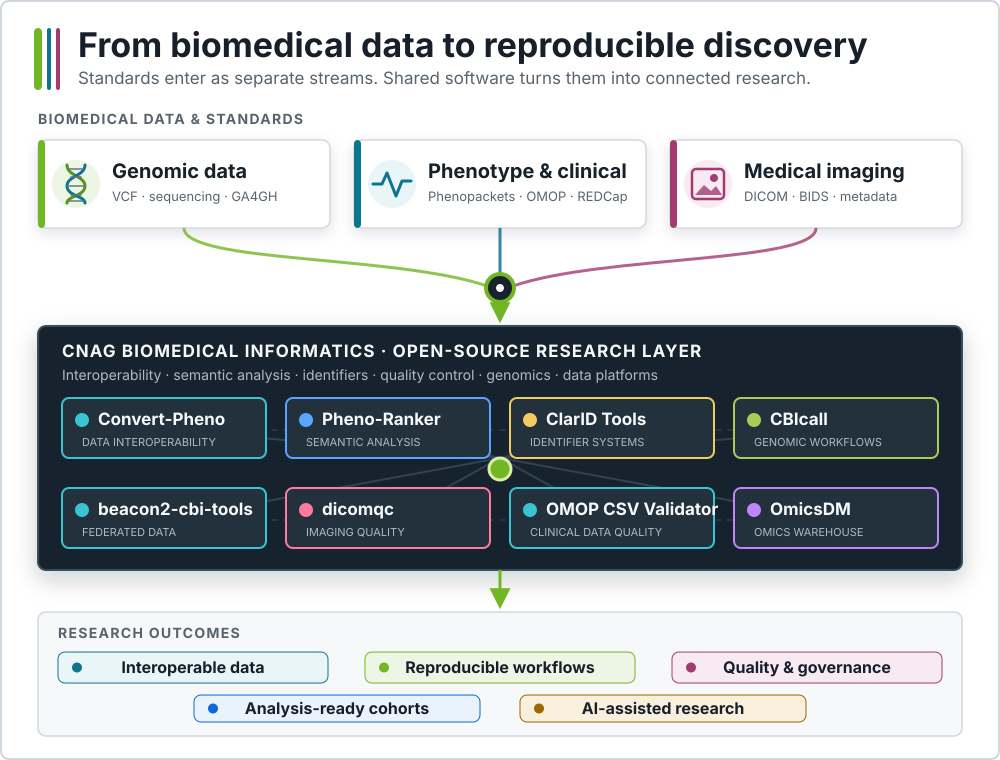

# CNAG Biomedical Informatics

**Building trustworthy computational infrastructure for biomedical discovery.**

CNAG Biomedical Informatics is a research software laboratory within
[CNAG's Biomedical Genomics Group](https://www.cnag.eu/teams/genome-research-unit/biomedical-genomics-group).
We develop open-source infrastructure that connects genomic, phenotypic,
clinical, and imaging data with reproducible analysis and trustworthy AI.

  

## Open-source software

Each project addresses a focused research need while contributing to a shared,
standards-based software ecosystem. Project names link to their documentation.

### Genomic data and workflows

- **[Beacon v2 CBI Tools](https://cnag-biomedical-informatics.github.io/beacon2-cbi-tools/)**
  validates and ingests data for GA4GH Beacon v2.
- **[CBIcall](https://cnag-biomedical-informatics.github.io/cbicall/)**
  runs configuration-driven genomic variant-calling workflows.

### Clinical and phenotypic data

- **[Convert-Pheno](https://cnag-biomedical-informatics.github.io/convert-pheno/)**
  interconverts biomedical and phenotypic data standards.
- **[Pheno-Ranker](https://cnag-biomedical-informatics.github.io/pheno-ranker/)**
  compares and ranks interoperable phenotypic profiles.
- **[OMOP CSV Validator](https://cnag-biomedical-informatics.github.io/omop-csv-validator/)**
  checks OMOP-CDM CSV datasets before ingestion.
- **[ClarID-Tools](https://cnag-biomedical-informatics.github.io/clarid-tools/)**
  generates and validates schema-driven biomedical identifiers.

### Imaging data

- **[dicomqc](https://cnag-biomedical-informatics.github.io/dicomqc/)**
  audits DICOM metadata de-identification and research-release readiness.

### Research data platforms

- **[OmicsDM](https://cnag-biomedical-informatics.github.io/omicsdm-documentation/)**
  stores and shares processed omics data with associated pheno-clinical
  information.
- **[COHORTome](https://github.com/CNAG-Biomedical-Informatics/cohortome)** is an
  open-source workbench for governed longitudinal and multimodal cohort analysis
  *(manuscript in preparation)*.

## How we work

We use established biomedical standards and transparent data models as shared
interfaces across the toolkit. Structured configuration and reusable workflows
make analyses inspectable and repeatable, while open development supports
long-term maintenance and reuse.

## Research context

Our work grows through collaboration with the
[Global Alliance for Genomics and Health (GA4GH)](https://www.ga4gh.org/), the
ELIXIR community, and European research initiatives in interoperable biomedical
data, federated analytics, translational informatics, and precision medicine,
including [3TR](https://3tr-imi.eu/),
[HEREDITARY](https://hereditary-project.eu/), and
[PRECISESADS](https://www.ihi.europa.eu/projects-results/project-factsheets/precisesads).

## Selected publications

- [ClarID](https://doi.org/10.1186/s13326-026-00349-6)
- [Beacon v2 Reference Implementation](https://doi.org/10.1093/bioinformatics/btac568)
- [OMOP CDM to Beacon v2 Interoperability](https://link.springer.com/article/10.1186/s12911-026-03649-0)
- [Convert-Pheno](https://doi.org/10.1016/j.jbi.2023.104558)
- [Pheno-Ranker](https://doi.org/10.1186/s12859-024-05993-2)

Our goal is practical: help researchers spend less time integrating data and
more time answering biological and clinical questions.
